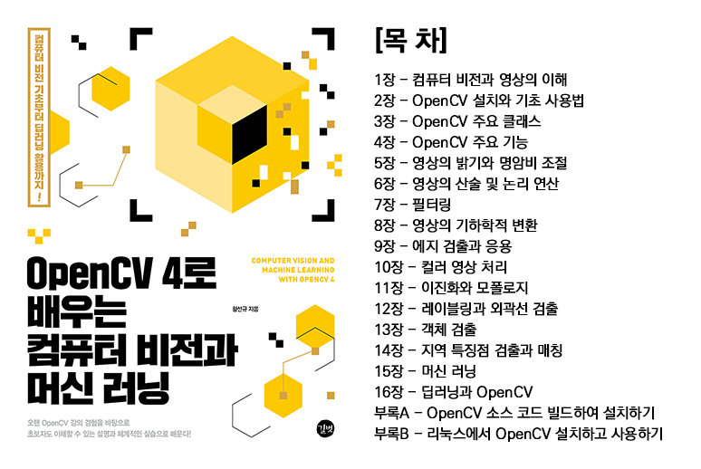

# openCV4 Study
[](http://www.yes24.com/Product/Goods/71829618)

- 해당 책을 참고하여 학습을 진행 하였다.


# 실습환경

``` 
* Ubuntu 20.04 LTS
* Clion
* opencv 4.10.0 + CUDA
* cmake 3.29
* CUDA 11.8
* CUDNN 9.8.0
```

## 학습 기간
- 25.03.05 ~ 25.03.27

# 챕터

----------
## ch02 - 설치와 기초 사용법
- [폴더](https://github.com/ji-hun-choi/openCVStudy/tree/master/ch02)
- [상세 설명](https://github.com/ji-hun-choi/openCVStudy/wiki/Ch-02)

## ch03 - 주요 클래스
- [폴더](https://github.com/ji-hun-choi/openCVStudy/tree/master/ch03)
- [상세 설명](https://github.com/ji-hun-choi/openCVStudy/wiki/Ch-03)

## ch04 - 주요 기능
- [폴더](https://github.com/ji-hun-choi/openCVStudy/tree/master/ch04)
- [상세 설명](https://github.com/ji-hun-choi/openCVStudy/wiki/Ch-04)
    
## ch05 - 밝기와 명암비 조절
- [폴더](https://github.com/ji-hun-choi/openCVStudy/tree/master/ch05)
- [상세 설명](https://github.com/ji-hun-choi/openCVStudy/wiki/Ch-05)

## ch06 - 영상의 산술 및 논리 연산 #TODO
- [폴더](https://github.com/ji-hun-choi/openCVStudy/tree/master/ch06)
- [상세 설명](https://github.com/ji-hun-choi/openCVStudy/wiki/Ch-06)

## ch07 - 필터링
- [폴더](https://github.com/ji-hun-choi/openCVStudy/tree/master/ch07)
- [상세 설명](https://github.com/ji-hun-choi/openCVStudy/wiki/Ch-07)

## ch08 - 영상의 기하학적 변환
- [폴더](https://github.com/ji-hun-choi/openCVStudy/tree/master/ch08)
- [상세 설명](https://github.com/ji-hun-choi/openCVStudy/wiki/Ch-08)

## ch09 - 에지 검출과 응용 
- [폴더](https://github.com/ji-hun-choi/openCVStudy/tree/master/ch09)
- [상세 설명](https://github.com/ji-hun-choi/openCVStudy/wiki/Ch-09)

## ch10 - 컬러 영상 처리
- [폴더](https://github.com/ji-hun-choi/openCVStudy/tree/master/ch10)
- [상세 설명](https://github.com/ji-hun-choi/openCVStudy/wiki/Ch-10)

## ch11 - 이진화와 모폴로지
- [폴더](https://github.com/ji-hun-choi/openCVStudy/tree/master/ch11)
- [상세 설명](https://github.com/ji-hun-choi/openCVStudy/wiki/Ch-11)

## ch12 - 레이블링과 외곽선 검출
- [폴더](https://github.com/ji-hun-choi/openCVStudy/tree/master/ch12)
- [상세 설명](https://github.com/ji-hun-choi/openCVStudy/wiki/Ch-12)

## ch13 - 객체 검출
- [폴더](https://github.com/ji-hun-choi/openCVStudy/tree/master/ch13)
- [상세 설명](https://github.com/ji-hun-choi/openCVStudy/wiki/Ch-13)

## ch14 - 지역 특징점 검출과 매칭
- [폴더](https://github.com/ji-hun-choi/openCVStudy/tree/master/ch14)
- [상세 설명](https://github.com/ji-hun-choi/openCVStudy/wiki/Ch-14)

## ch15 - 머신 러닝
- [폴더](https://github.com/ji-hun-choi/openCVStudy/tree/master/ch15)
- [상세 설명](https://github.com/ji-hun-choi/openCVStudy/wiki/Ch-15)

## ch16 - 딥러닝과 OpenCV #TODO
- [폴더](https://github.com/ji-hun-choi/openCVStudy/tree/master/ch16)
- [상세 설명](https://github.com/ji-hun-choi/openCVStudy/wiki/Ch-16)
